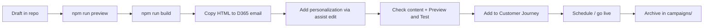

# Dynamics 365 Customer Insights — Journeys

All emails from this repo are drafted here, then imported into **Dynamics 365 Customer Insights — Journeys** for scheduling and sending.

## End-to-end workflow



1. **Draft** — create and iterate on MJML in `drafts/`
2. **Build** — `npm run build` → HTML in `dist/`
3. **Import** — in D365, create a new marketing email → **Design → HTML** tab → paste compiled HTML
4. **Personalize** — use the **Personalization** (assist edit) button to verify or add dynamic tokens
5. **Validate** — run **Check content** (requires subscription center link + physical address)
6. **Test** — **Preview and Test** tab with sample contact records
7. **Schedule** — add the email to a **Customer Journey**, assign **Content Settings**, set send timing, go live
8. **Archive** — move the draft folder to `campaigns/` after send

## Importing HTML into D365

1. Open **Customer Insights — Journeys** → **Emails** → **New email**
2. Go to **Design → HTML** tab
3. Clear the default content and paste HTML from `dist/drafts/<campaign>/email.html`
4. Switch to **Design → Designer** tab to inspect layout
5. Use **Personalization** to confirm dynamic tokens resolve correctly

> Microsoft does not support custom HTML in emails. Test thoroughly with **Check content** and **Preview and Test** before going live.

### Making sections editable in D365 (optional)

Wrap editable regions with `data-editorblocktype` attributes so marketers can adjust copy in the designer without re-importing HTML:

```html
<div data-editorblocktype="Text">
  <p>Editable paragraph text</p>
</div>
```

See [Microsoft docs: custom template attributes](https://learn.microsoft.com/en-us/dynamics365/customer-insights/journeys/custom-template-attributes).

## Required compliance fields

All emails end with the corporate footer (`components/footer.mjml`):

1. **Orange address band** — Weidmuller USA + Richmond, VA office details
2. **D365 compliance block** (`WM_footer` content block) — copyright, address, unsubscribe

| Requirement | Token | Notes |
|-------------|-------|-------|
| Company address | `{{CompanyAddress}}` | In `WM_footer` content block |
| Unsubscribe | `{{PreferenceCenter}}` | Preference center link in footer |

These tokens are resolved by Dynamics 365 at send time. Do not remove or replace the footer include from templates.

### Content Settings

- Configure under **Settings → Email marketing → Content settings** (or **Marketing templates → Content settings**)
- Each Customer Journey uses one Content Settings record
- The `WM_footer` content block reference (`data-lookup-name="WM_footer"`) must exist in your D365 tenant

## Personalization tokens

### Contact fields (recipient)

| Token | Example output |
|-------|----------------|
| `{{contact.firstname}}` | Alex |
| `{{contact.lastname}}` | Smith |
| `{{contact.emailaddress1}}` | alex@example.com |

Use the **Personalization** button in the D365 designer to browse all available contact and related-table fields.

### Content settings

| Token | Purpose |
|-------|---------|
| `{{msdyncrm_contentsettings.msdyncrm_addressmain}}` | Sender physical address |
| `{{msdyncrm_contentsettings.msdyncrm_subscriptioncenter}}` | Unsubscribe / preferences link |
| `{{msdyncrm_contentsettings.msdyncrm_sendername}}` | Default sender name |
| `{{msdyncrm_contentsettings.msdyncrm_senderemail}}` | Default sender email |

### Draft placeholders vs D365 tokens

In MJML templates, placeholders like `{{headline}}` and `{{body_copy}}` are **draft reminders** — replace them with final copy before building and importing.

D365 tokens like `{{contact.firstname}}` should be kept as-is; D365 resolves them at send time.

## Scheduling and sending

Emails are not sent from this repo. In D365:

1. **Create a Customer Journey** (or add to an existing one)
2. Add an **Email** tile and select your imported email
3. On the journey **General** tab, assign the correct **Content Settings**
4. Configure the audience segment and trigger
5. Set schedule (immediate, delayed, or date-based)
6. **Go live** on the journey

For one-off sends, use **Send now** from the email record after validation.

## Size and testing limits

- Emails are stored as HTML with a **1 MB maximum** (including client-specific markup)
- Subscription center links do not work in all test modes — validate in a live journey or full send test
- Always use **Preview and Test** with real contact sample data before go-live

## Checklist before go-live

- [ ] Replaced all draft placeholders (`{{headline}}`, etc.) with final copy
- [ ] Footer includes address and subscription center tokens
- [ ] **Check content** passes with no errors
- [ ] **Preview and Test** reviewed with sample contacts
- [ ] Subject line and preheader set in D365 email header
- [ ] Content Settings assigned on the Customer Journey
- [ ] Journey audience and schedule confirmed
- [ ] Draft folder moved to `campaigns/` after send

## Useful links

- [Create marketing emails](https://learn.microsoft.com/en-us/dynamics365/customer-insights/journeys/real-time-marketing-email)
- [Personalize with dynamic text](https://learn.microsoft.com/en-us/dynamics365/customer-insights/journeys/real-time-marketing-predefined-dynamic-text)
- [Custom HTML template attributes](https://learn.microsoft.com/en-us/dynamics365/customer-insights/journeys/custom-template-attributes)
- [Set up subscription center](https://learn.microsoft.com/en-us/dynamics365/customer-insights/journeys/set-up-subscription-center)
